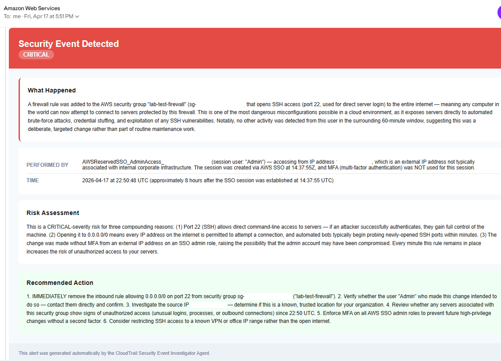
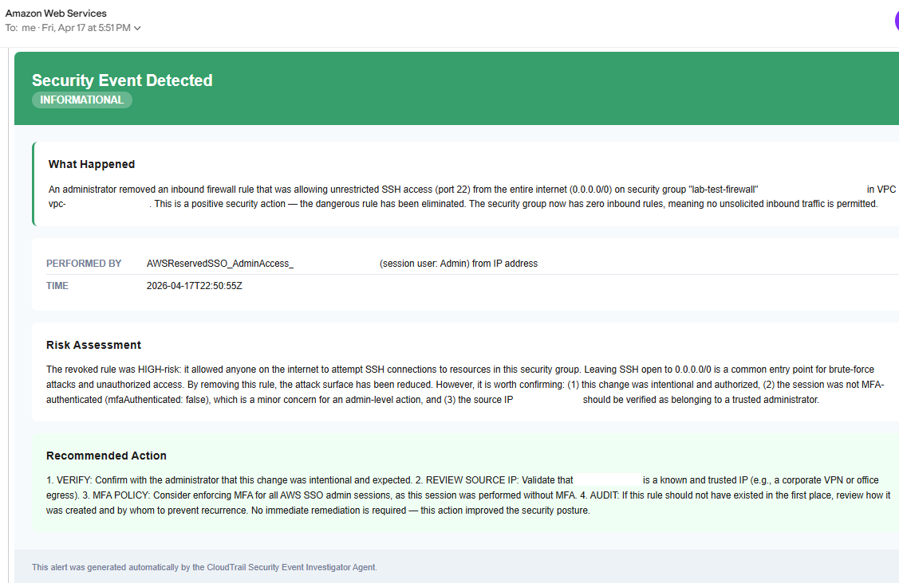

# Build an AI Security Investigator with AWS AgentCore

Most security tools tell you something happened. They don't tell you what it means or what to do about it.

This lab walks you through building an AI agent that watches your AWS account for suspicious firewall changes, investigates what happened, and sends you a plain-English email explaining the risk and what to do next. No dashboards. No manual log queries. The agent does the work.

---

## What You Will Build

```
CloudTrail → EventBridge → Lambda → AgentCore → SES + Security Hub
```

When a firewall rule changes in your AWS account, this pipeline automatically wakes up, investigates the full context of what happened, and delivers a clear security report to your inbox.

---

## Example Alert Email

This is what the agent sends you when it detects a critical firewall change.





---

## Think Like a Systems Engineer

Before touching a single command, understand what each piece does and why it exists.

| Service | Role in the Pipeline | What breaks without it |
|---|---|---|
| CloudTrail | Records every API call in your account | Nothing gets detected - no record, no trigger |
| EventBridge | Watches CloudTrail and routes specific events | Events are recorded but nothing acts on them |
| Lambda | Receives the event and wakes up the agent | The agent has no way to receive events from AWS |
| AgentCore | Runs the AI agent and its tools | No investigation happens - just raw event data |
| Bedrock | Hosts the Claude AI model the agent uses | The agent has no reasoning capability |
| SES | Delivers the investigation email | Findings exist but no one gets notified |
| Security Hub | Stores the official compliance finding | No audit trail, no compliance mapping |
| Secrets Manager | Stores your email address securely | Sensitive config lives in your code and your repo |
| IAM | Controls what each service is allowed to do | Nothing can talk to anything else |

Every service in this pipeline has one job. If any one of them is missing or misconfigured, the chain breaks at that point.

---

## What the Agent Actually Does

The agent is not a script that follows hardcoded steps. It reasons.

When it receives a security event it decides on its own:
- Which CloudTrail logs to query and for how long
- Whether the security group change is worth investigating further
- How severe the risk is based on what port was opened and to what IP range
- What to say in the email and how to frame the recommended action
- What severity label and compliance mapping to assign in Security Hub

You define the tools it can use and the rules it reasons by. The agent decides how to use them.

---

## Prerequisites

- An AWS account
- Python 3.10 installed - AgentCore requires exactly 3.10, newer versions will fail
- AWS CLI installed and configured
- `uv` package manager installed - used to create a Python 3.10 virtual environment
- VS Code or any code editor
- Estimated cost: under $1 for a single lab run

---

## Repo Structure

```
ai-security-investigator-with-aws-agentcore/
├── agent/
│   ├── tools/
│   │   ├── __init__.py
│   │   ├── cloudtrail_tools.py
│   │   ├── ec2_tools.py
│   │   ├── notification_tools.py
│   │   └── security_hub_tools.py
│   ├── agent.py
│   └── requirements.txt
├── lambda/
│   └── lambda_function.py
├── screenshots/
│   ├── critical-alert.png
│   └── informational-alert.png
├── agent-policy.json
├── agent-trust-policy.json
├── event-pattern.json
├── lambda-policy.json
├── lambda-trust-policy.json
└── README.md
```

All code files are included. Follow the Setup section below to deploy them to your AWS account.

---

## Setup

### Part 1 - Environment and IAM

**Install Python 3.10**

AgentCore requires Python 3.10 specifically. Newer versions will cause the install to fail.

<details>
<summary>Mac</summary>

```bash
brew install python@3.10
python3.10 --version
```

</details>

<details>
<summary>Windows</summary>

Download from [python.org/downloads/release/python-31011](https://www.python.org/downloads/release/python-31011/)

</details>

---

**Install uv**

`uv` creates a virtual environment locked to Python 3.10. Regular `venv` uses whatever Python version is set as default on your machine, which may not be 3.10.

<details>
<summary>Install uv</summary>

```bash
curl -LsSf https://astral.sh/uv/install.sh | sh
source ~/.zshrc
uv --version
```

</details>

---

**Understand IAM roles before creating them**

Every IAM role has two parts:

- Trust policy - who is allowed to use this role
- Permissions policy - what that role can actually do

Think of it like a hotel key card. The trust policy controls who gets issued the key. The permissions policy controls which doors it opens.

This lab uses two roles:

- `CloudTrailInvestigatorAgentRole` - used by Bedrock and AgentCore to run the agent
- `CloudTrailInvestigatorLambdaRole` - used by Lambda to invoke the agent and write logs

The JSON files for both roles are in the `iam/` folder of this repo.

**Create the agent role**

<details>
<summary>Agent role commands</summary>

```bash
aws iam create-role \
    --profile YOUR_PROFILE \
    --role-name CloudTrailInvestigatorAgentRole \
    --assume-role-policy-document file://iam/agent-trust-policy.json

aws iam create-policy \
    --profile YOUR_PROFILE \
    --policy-name CloudTrailInvestigatorAgentPolicy \
    --policy-document file://iam/agent-policy.json

aws iam attach-role-policy \
    --profile YOUR_PROFILE \
    --role-name CloudTrailInvestigatorAgentRole \
    --policy-arn arn:aws:iam::YOUR_ACCOUNT_ID:policy/CloudTrailInvestigatorAgentPolicy
```

</details>

**Create the Lambda role**

<details>
<summary>Lambda role commands</summary>

```bash
aws iam create-role \
    --profile YOUR_PROFILE \
    --role-name CloudTrailInvestigatorLambdaRole \
    --assume-role-policy-document file://iam/lambda-trust-policy.json

aws iam create-policy \
    --profile YOUR_PROFILE \
    --policy-name CloudTrailInvestigatorLambdaPolicy \
    --policy-document file://iam/lambda-policy.json

aws iam attach-role-policy \
    --profile YOUR_PROFILE \
    --role-name CloudTrailInvestigatorLambdaRole \
    --policy-arn arn:aws:iam::YOUR_ACCOUNT_ID:policy/CloudTrailInvestigatorLambdaPolicy

aws iam attach-role-policy \
    --profile YOUR_PROFILE \
    --role-name CloudTrailInvestigatorLambdaRole \
    --policy-arn arn:aws:iam::aws:policy/service-role/AWSLambdaBasicExecutionRole
```

</details>

---

**Enable CloudTrail**

CloudTrail must be active for EventBridge to detect security group changes. If it is not running, nothing in the pipeline will trigger.

<details>
<summary>CloudTrail setup commands</summary>

```bash
# Create an S3 bucket for CloudTrail logs
aws s3api create-bucket \
    --profile YOUR_PROFILE \
    --bucket cloudtrail-logs-YOUR_ACCOUNT_ID \
    --region us-east-1

# Add the required bucket policy
aws s3api put-bucket-policy \
    --profile YOUR_PROFILE \
    --bucket cloudtrail-logs-YOUR_ACCOUNT_ID \
    --policy '{
        "Version": "2012-10-17",
        "Statement": [
            {
                "Sid": "AWSCloudTrailAclCheck",
                "Effect": "Allow",
                "Principal": {"Service": "cloudtrail.amazonaws.com"},
                "Action": "s3:GetBucketAcl",
                "Resource": "arn:aws:s3:::cloudtrail-logs-YOUR_ACCOUNT_ID"
            },
            {
                "Sid": "AWSCloudTrailWrite",
                "Effect": "Allow",
                "Principal": {"Service": "cloudtrail.amazonaws.com"},
                "Action": "s3:PutObject",
                "Resource": "arn:aws:s3:::cloudtrail-logs-YOUR_ACCOUNT_ID/AWSLogs/YOUR_ACCOUNT_ID/*",
                "Condition": {
                    "StringEquals": {"s3:x-amz-acl": "bucket-owner-full-control"}
                }
            }
        ]
    }'

# Create the trail
aws cloudtrail create-trail \
    --profile YOUR_PROFILE \
    --name cloudtrail-investigator-trail \
    --s3-bucket-name cloudtrail-logs-YOUR_ACCOUNT_ID \
    --is-multi-region-trail \
    --region us-east-1

# Start logging
aws cloudtrail start-logging \
    --profile YOUR_PROFILE \
    --name cloudtrail-investigator-trail \
    --region us-east-1

# Verify it is running - look for "IsLogging": true
aws cloudtrail get-trail-status \
    --profile YOUR_PROFILE \
    --name cloudtrail-investigator-trail \
    --region us-east-1
```

</details>

---

**Enable Security Hub**

<details>
<summary>Security Hub command</summary>

```bash
aws securityhub enable-security-hub \
    --profile YOUR_PROFILE \
    --region us-east-1 \
    --enable-default-standards
```

</details>

---

**Verify your SES email**

SES requires email verification before it can send from your address. Check your inbox and click the AWS verification link before continuing.

<details>
<summary>SES verification command</summary>

```bash
aws ses verify-email-identity \
    --profile YOUR_PROFILE \
    --email-address your-email@domain.com \
    --region us-east-1
```

</details>

---

**Enable Bedrock model access**

Go to the AWS Console - Amazon Bedrock - Model catalog - confirm Anthropic Claude Sonnet is enabled in your region.

---

**Store your email in Secrets Manager**

The agent retrieves your email at runtime from Secrets Manager. This keeps sensitive values out of your code and your repo.

<details>
<summary>Secrets Manager command</summary>

```bash
aws secretsmanager create-secret \
    --profile YOUR_PROFILE \
    --name cloudtrail-investigator/notifications \
    --secret-string '{"sender_email": "your-email@domain.com", "recipient_email": "your-email@domain.com"}' \
    --region us-east-1
```

</details>

---

### Part 2 - Build the Agent

**Create the folder structure**

```bash
mkdir -p agent/tools
```

Your agent folder needs these files:

```
agent/
├── tools/
│   ├── __init__.py
│   ├── cloudtrail_tools.py
│   ├── ec2_tools.py
│   ├── notification_tools.py
│   └── security_hub_tools.py
├── agent.py
└── requirements.txt
```

**What each file does**

`agent.py` - the brain. Defines the AI model, the tools it has access to, and a system prompt that tells it how to investigate events and assess severity. Also defines the entry point that receives events from Lambda.

`tools/cloudtrail_tools.py` - queries CloudTrail for everything the same user did in the 60 minutes surrounding the event. This is what lets the agent detect suspicious patterns, not just isolated actions.

`tools/ec2_tools.py` - looks up the details of the security group that was modified. Read-only. Gives the agent context about what the firewall change actually did.

`tools/notification_tools.py` - sends the investigation email via SES. Retrieves your email address from Secrets Manager at runtime. The agent fills in all the content: what happened, who did it, the risk assessment, the recommended action.

`tools/security_hub_tools.py` - creates an official finding in Security Hub with severity scoring and compliance notes mapped to NIST 800-53 (SI-4) and SOC 2 (CC7.2).

`tools/__init__.py` - makes the tools folder a Python package so `agent.py` can import from it.

`requirements.txt` - lists the Python packages the agent needs:

```
bedrock-agentcore>=0.1.0
bedrock-agentcore-starter-toolkit>=0.1.21
strands-agents>=0.1.0
strands-agents-tools>=0.1.0
boto3>=1.35.0
```

---

### Part 3 - Deploy the Agent

**Create and activate a Python 3.10 virtual environment**

<details>
<summary>Virtual environment setup</summary>

```bash
cd agent
uv venv --python 3.10

# Mac/Linux
source .venv/bin/activate

# Windows Git Bash
source .venv/Scripts/activate
```

You should see `(agent)` at the start of your prompt.

</details>

---

**Install dependencies**

<details>
<summary>Install commands</summary>

```bash
uv pip install bedrock-agentcore-starter-toolkit
uv pip install -r requirements.txt
```

</details>

---

**Configure the agent**

<details>
<summary>Configure command and prompts</summary>

```bash
AWS_PROFILE=YOUR_PROFILE agentcore configure -e agent.py
```

When prompted:
- Agent name: `CloudTrailInvestigator`
- Execution Role ARN: paste your agent role ARN
- S3 bucket: press Enter to auto-create
- OAuth authorizer: no
- Request header allowlist: no
- Memory: press `s` to skip

</details>

---

**Deploy to AWS**

```bash
AWS_PROFILE=YOUR_PROFILE agentcore deploy
```

This takes 3-5 minutes. Copy the Agent ARN from the output - you need it in the next step.

**Verify the agent is working**

```bash
AWS_PROFILE=YOUR_PROFILE agentcore invoke '{"prompt": "Hello"}'
```

You should get a response and receive a test email. If you get a 500 error, check that your model ID in `agent.py` matches an available model in your Bedrock account:

```bash
aws bedrock list-foundation-models \
    --profile YOUR_PROFILE \
    --region us-east-1 \
    --query 'modelSummaries[?contains(modelId, `claude`) == `true`].modelId' \
    --output table
```

---

### Part 4 - Wire the Pipeline and Test

**Deploy the Lambda function**

Lambda is the bridge between EventBridge and the agent. It receives the raw CloudTrail event, extracts the relevant fields, and passes them to the agent.

<details>
<summary>Lambda deploy commands</summary>

```bash
cd lambda
zip lambda_function.zip lambda_function.py

aws lambda create-function \
    --profile YOUR_PROFILE \
    --function-name cloudtrail-event-investigator \
    --runtime python3.12 \
    --handler lambda_function.lambda_handler \
    --role arn:aws:iam::YOUR_ACCOUNT_ID:role/CloudTrailInvestigatorLambdaRole \
    --zip-file fileb://lambda_function.zip \
    --timeout 60 \
    --memory-size 256 \
    --environment Variables={AGENT_ARN=YOUR_AGENT_ARN} \
    --region us-east-1
```

</details>

---

**Add invoke permission to the Lambda role**

Lambda needs explicit permission to call the AgentCore agent. The `*` at the end of the ARN is required - it covers the runtime endpoint suffix that AgentCore appends automatically.

<details>
<summary>Invoke permission command</summary>

```bash
aws iam put-role-policy \
    --profile YOUR_PROFILE \
    --role-name CloudTrailInvestigatorLambdaRole \
    --policy-name AgentCoreInvokePolicy \
    --policy-document '{"Version":"2012-10-17","Statement":[{"Effect":"Allow","Action":"bedrock-agentcore:InvokeAgentRuntime","Resource":"YOUR_AGENT_ARN*"}]}'
```

</details>

---

**Create the EventBridge rule**

EventBridge watches CloudTrail and fires when it detects a security group change. The `event-pattern.json` file in this repo defines exactly which events to watch for.

<details>
<summary>EventBridge commands</summary>

```bash
cd ..

aws events put-rule \
    --profile YOUR_PROFILE \
    --name cloudtrail-security-group-changes \
    --event-pattern file://event-pattern.json \
    --state ENABLED \
    --region us-east-1

aws lambda add-permission \
    --profile YOUR_PROFILE \
    --function-name cloudtrail-event-investigator \
    --statement-id allow-eventbridge \
    --action lambda:InvokeFunction \
    --principal events.amazonaws.com \
    --source-arn arn:aws:events:us-east-1:YOUR_ACCOUNT_ID:rule/cloudtrail-security-group-changes

aws events put-targets \
    --profile YOUR_PROFILE \
    --rule cloudtrail-security-group-changes \
    --targets Id=lambda-target,Arn=arn:aws:lambda:us-east-1:YOUR_ACCOUNT_ID:function:cloudtrail-event-investigator
```

</details>

---

**Test the pipeline**

Create a test security group, trigger the agent by opening a dangerous port, then close it immediately.

<details>
<summary>Test commands</summary>

```bash
# Create a test security group
aws ec2 create-security-group \
    --profile YOUR_PROFILE \
    --group-name lab-test-firewall \
    --description "Test security group for CloudTrail lab" \
    --region us-east-1
```

Note the `GroupId` from the output, then run:

```bash
# Open port 22 to the internet - this triggers the agent
aws ec2 authorize-security-group-ingress \
    --profile YOUR_PROFILE \
    --group-id sg-YOUR-GROUP-ID \
    --protocol tcp \
    --port 22 \
    --cidr 0.0.0.0/0 \
    --region us-east-1

# Close it immediately
aws ec2 revoke-security-group-ingress \
    --profile YOUR_PROFILE \
    --group-id sg-YOUR-GROUP-ID \
    --protocol tcp \
    --port 22 \
    --cidr 0.0.0.0/0 \
    --region us-east-1
```

</details>

Check your inbox within 5 minutes. You should receive two emails - one CRITICAL for opening the port, one INFORMATIONAL for closing it.

**Watch the Lambda logs**

<details>
<summary>Log commands</summary>

```bash
# Mac/Linux
aws logs tail /aws/lambda/cloudtrail-event-investigator --profile YOUR_PROFILE --follow

# Windows Git Bash
MSYS_NO_PATHCONV=1 aws logs tail /aws/lambda/cloudtrail-event-investigator --profile YOUR_PROFILE --follow
```

</details>

---

## Troubleshooting

<details>
<summary>No email after 15 minutes</summary>

Check each link in the chain in order:

1. Is CloudTrail logging? Run `aws cloudtrail get-trail-status --profile YOUR_PROFILE --name cloudtrail-investigator-trail` and look for `"IsLogging": true`
2. Is EventBridge firing? Check Lambda logs for `Received event`
3. Is the agent responding? Check Lambda logs for `Error invoking agent`
4. Is your email verified in SES? Run `aws ses list-identities --profile YOUR_PROFILE --region us-east-1`

</details>

<details>
<summary>500 error from agent runtime</summary>

Usually a wrong model ID. Check available models in your Bedrock account:

```bash
aws bedrock list-foundation-models \
    --profile YOUR_PROFILE \
    --region us-east-1 \
    --query 'modelSummaries[?contains(modelId, `claude`) == `true`].modelId' \
    --output table
```

Update the `model_id` in `agent.py` to match one of the available models.

</details>

<details>
<summary>agentcore: command not found</summary>

Your virtual environment is not active. Run:

```bash
# Mac/Linux
source agent/.venv/bin/activate

# Windows Git Bash
source agent/.venv/Scripts/activate
```

</details>

<details>
<summary>/aws/lambda/... path error on Windows Git Bash</summary>

Git Bash converts paths starting with `/` into Windows file paths. Prefix the command with `MSYS_NO_PATHCONV=1`:

```bash
MSYS_NO_PATHCONV=1 aws logs tail /aws/lambda/cloudtrail-event-investigator --profile YOUR_PROFILE --follow
```

</details>

<details>
<summary>AccessDeniedException: not authorized to perform bedrock-agentcore:InvokeAgentRuntime</summary>

The Lambda role is missing the AgentCore invoke permission. Add it with `aws iam put-role-policy` and make sure the ARN ends with `*`.

</details>

<details>
<summary>Unknown service: 'bedrock-agentcore-runtime'</summary>

The boto3 service name is wrong. Use `bedrock-agentcore`, not `bedrock-agentcore-runtime`.

</details>

---

## Clean Up

<details>
<summary>Full cleanup commands</summary>

```bash
# Remove EventBridge target and rule
aws events remove-targets --profile YOUR_PROFILE --rule cloudtrail-security-group-changes --ids lambda-target
aws events delete-rule --profile YOUR_PROFILE --name cloudtrail-security-group-changes

# Delete Lambda function
aws lambda delete-function --profile YOUR_PROFILE --function-name cloudtrail-event-investigator

# Delete test security group
aws ec2 delete-security-group --profile YOUR_PROFILE --group-id sg-YOUR-GROUP-ID --region us-east-1

# Destroy AgentCore agent
cd agent
AWS_PROFILE=YOUR_PROFILE agentcore destroy

# Delete Secrets Manager secret
aws secretsmanager delete-secret \
    --profile YOUR_PROFILE \
    --secret-id cloudtrail-investigator/notifications \
    --force-delete-without-recovery \
    --region us-east-1

# Delete CloudTrail trail and S3 bucket
aws cloudtrail stop-logging --profile YOUR_PROFILE --name cloudtrail-investigator-trail
aws cloudtrail delete-trail --profile YOUR_PROFILE --name cloudtrail-investigator-trail
aws s3 rb s3://cloudtrail-logs-YOUR_ACCOUNT_ID --force --profile YOUR_PROFILE

# Delete IAM roles and policies
aws iam detach-role-policy --profile YOUR_PROFILE --role-name CloudTrailInvestigatorLambdaRole --policy-arn arn:aws:iam::YOUR_ACCOUNT_ID:policy/CloudTrailInvestigatorLambdaPolicy
aws iam detach-role-policy --profile YOUR_PROFILE --role-name CloudTrailInvestigatorLambdaRole --policy-arn arn:aws:iam::aws:policy/service-role/AWSLambdaBasicExecutionRole
aws iam delete-role-policy --profile YOUR_PROFILE --role-name CloudTrailInvestigatorLambdaRole --policy-name AgentCoreInvokePolicy
aws iam delete-role --profile YOUR_PROFILE --role-name CloudTrailInvestigatorLambdaRole
aws iam delete-policy --profile YOUR_PROFILE --policy-arn arn:aws:iam::YOUR_ACCOUNT_ID:policy/CloudTrailInvestigatorLambdaPolicy
aws iam delete-policy --profile YOUR_PROFILE --policy-arn arn:aws:iam::YOUR_ACCOUNT_ID:policy/CloudTrailInvestigatorAgentPolicy
```

</details>

---

## Compliance Mapping

Security findings generated by this lab are mapped to:

| Framework | Control | Description |
|---|---|---|
| NIST 800-53 | SI-4 | System Monitoring |
| SOC 2 | CC7.2 | Anomaly and Incident Detection |

---
